>`Docker` - это ПО, которое позволяет упаковать приложение в контейнер и развернуть его на любой Linux-системе с поддержкой контрольных групп в ядре. Помогает разработчикам создавать, делить и запускать приложения в любой среде без сложной настройки окружения.

## Part 1. Ready-made docker.

>`docker image` - это пакет, который содержит в себе урезанную ОС, которая нужна для запуска приложения, код приложения и среда исполнения кода, плюс все зависимости (библиотеки, доп.программы и прочее). Плюс все необходимые настройки приложения, чтобы оно знало с какой конфигурацией все запускается и так далее.

+ **Take the official docker image from nginx and download it using `docker pull`.**\
**Возьми официальный докер-образ с nginx и выкачай его при помощи `docker pull`**

>`docker pull`-  команда, которая используется для загрузки образа контейнера из DockerHub или другого репозитория Docker. В дальнейшем можно использовать этот образ для создания собственных контейнеров с помощью команды `docker run`.

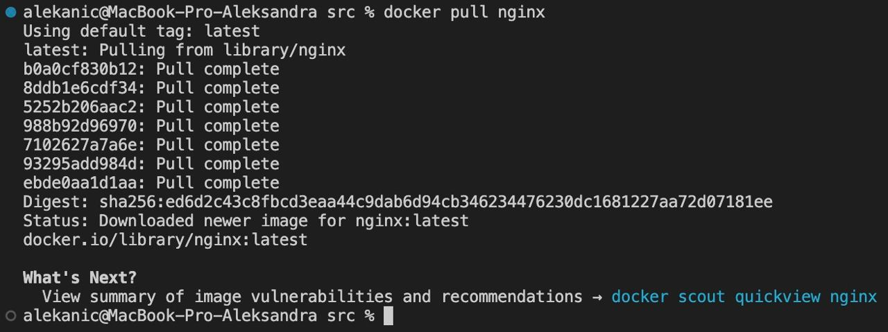\
*Использование команды docker pull*

+ **Check for the docker image with `docker images`.**\
**Проверить наличие докер-образа через `docker images`**

>`docker images` - команда, которая используется для отображения списка всех изображений, которые в данный момент находятся в локальном репозитории Docker

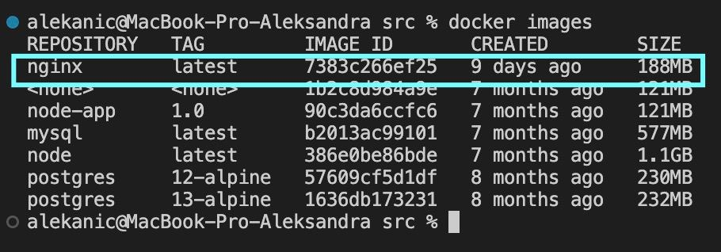\
*Использование команды docker images*

+ **Run docker image with `docker run -d` [image_id|repository].**\
**Запусти докер-образ через `docker run -d` [image_id|repository]**

>`docker run -d` - используется для запуска контейнера в фоновом режиме. Это означает, что контейнер не будет выведен в консоль.

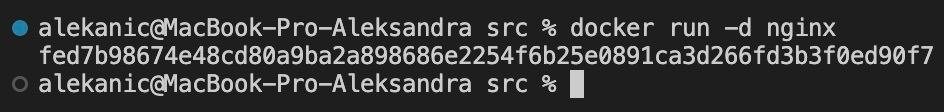\
*Использование команды docker run -d*

+ **Check that the image is running with `docker ps`.**\
**Проверь, что образ запустился через `docker ps`**

>`docker ps` - используется для мониторинга запущенных контейнеров, работает аналогично команде `ps` в Unix-системах, позволяет увидеть список всех активных контейнеров, их идентификаторы, порты, IP-адреса и другую информацию. 

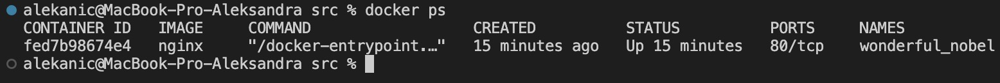\
*Использование команды docker ps*

+ **View container information with `docker inspect` [container_id|container_name].**\
**Посмотри информацию о контейнере через `docker inspect` [container_id|container_name].**

>`docker inspect` - это команда, которая позволяет получить подробную информацию о контейнере. Она выводит структуру данных JSON, которая содержит все атрибуты и свойства контейнера, включая его ID, имя, IP-адрес, порты, объем использованной памяти, список процессов внутри контейнера и другую информацию.

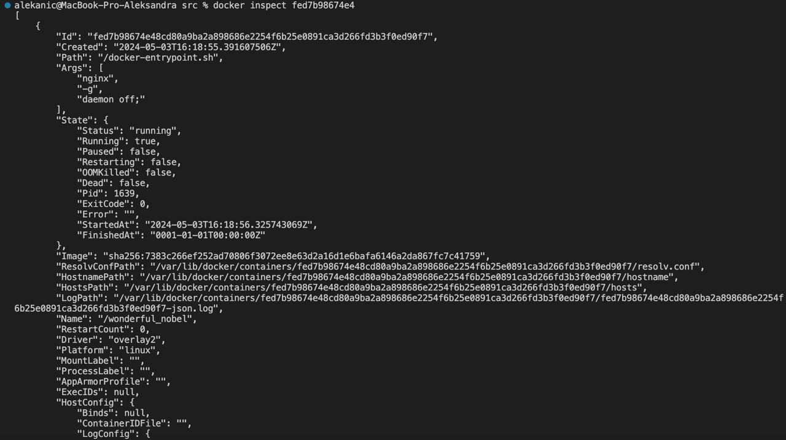\
*Использование команды docker inspect*

+ **From the command output define and write in the report the container size, list of mapped ports and container ip.**\
**По выводу команды определи и помести в отчёт размер контейнера, список замапленных портов и ip контейнера.**

>По умолчанию, Docker запускает сервис изолированно - то есть все порты между хостом и Docker-контейнером закрыты. Для того, чтобы получить доступ к сервису с хоста или из внешней сети, нужно использовать `сопоставление портов` или `маппинг`.\
\
Маппинг нужен для того, чтобы все запросы, проходящие через порт хоста, перенаправлялись в Docker-контейнер. Другими словами, сопоставление портов делает процессы внутри контейнера доступными извне.

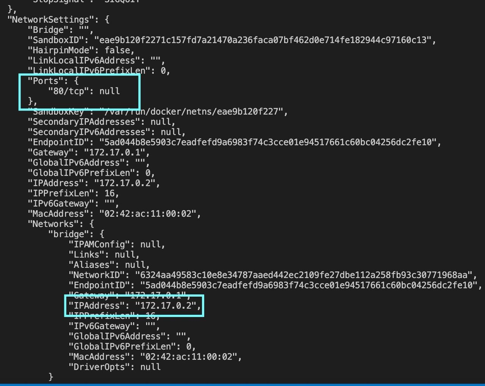\
*Замапленные порты и IP контейнера*

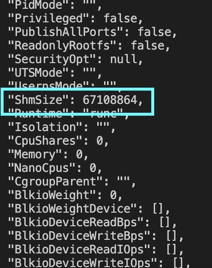\
*Размер контейнера*

+ **Stop docker image with `docker stop` [container_id|container_name].**\
**Останови докер образ через `docker stop` [container_id|container_name].**

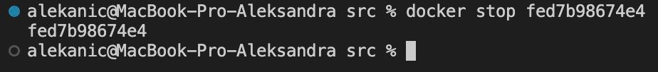\
*Использование команды docker stop*

+ **Check that the image has stopped with `docker ps`.**\
**Проверь, что образ остановился через `docker ps`**

\
*Использование команды docker ps*

+ **Run docker with ports 80 and 443 in container, mapped to the same ports on the local machine, with `run` command.**\
**Запусти докер с портами 80 и 443 в контейнере, замапленными на такие же порты на локальной машине, через команду `run`.**

\
*Использование команды docker run*

+ **Check that the nginx start page is available in the browser at `localhost:80`.**\
**Проверь, что в браузере по адресу `localhost:80` доступна стартовая страница nginx.**

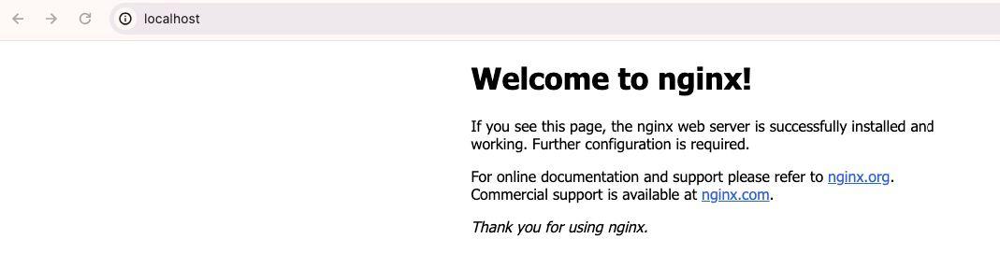\
*Стартовая страница nginx на localhost:80*

+ **Restart docker container with docker restart [container_id|container_name].**\
**Перезапусти докер контейнер через docker restart [container_id|container_name].**

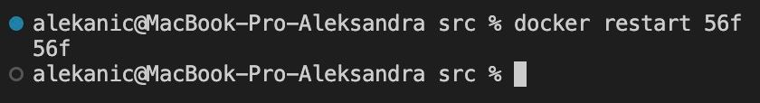\
*Использование команды docker restart*

+ **Check in any way that the container is running.**\
**Проверь любым способом, что контейнер запустился.**

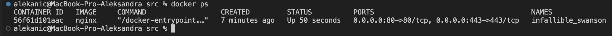\
*Использование команды docker ps*

# Part 2. Operations with container.

+ **Read the `nginx.conf` configuration file inside the docker container with the `exec` command.**\
**Прочитай конфигурационный файл `nginx.conf` внутри докер контейнера через команду `exec`.**

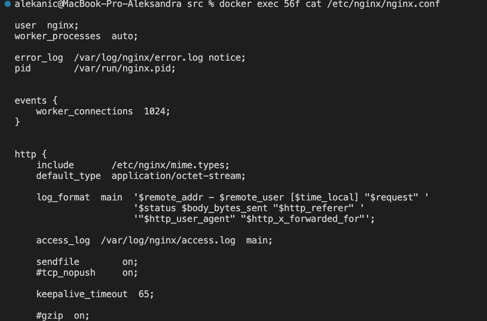\
*Использование команды cat для просмотра nginx.conf*

+ **Create a `nginx.conf` file on a local machine. Configure it on the /status path to return the nginx server status page.**\
**Создай на локальной машине файл `nginx.conf`. Настрой в нем по пути /status отдачу страницы статуса сервера nginx.**

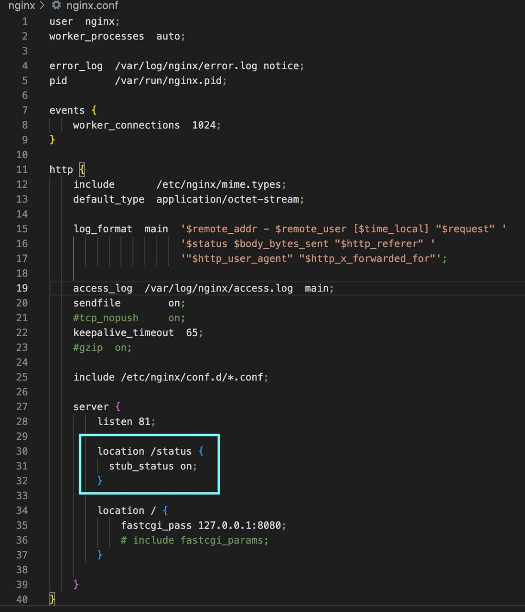\
*Cоздание nginx.conf*

>`http {}` - этот блок относится к HTTP-серверу nginx \
`include /etc/nginx/mime.types` - включает файл mime.types, который содержит список типов MIME, используемых для определения типов содержимого \
`default_type` - устанавливает тип содержимого по умолчанию для запросов, для которых не указан тип содержимого. `octet-stream` - это общий тип для двоичных файлов \
`access_log` - указывает, куда nginx должен записывать логи доступа \
`sendfile on` - включает использование системного вызова sendfile для ускорения передачи файлов \
`keepalive timeout 65` - устанавливает время ожидания для повторного использования соединения, после того как клиент отправил запрос \
`server {}` - этот блок относится к определению сервера \
`listen 81` - сервер должен слушать порт 81 \
`location /status {}` - определяет блок location, который обрабатывает запросы к `/status` \
`stub_status on` - включает вывод статуса nginx в формате, который может быть легко обработан \
`location {}` - определяет блок `location`, который обрабатывает все запросы, не попадающие под другие определения `location` \
`fastgi_pass 127.0.0.1:8080` - указывает, что все запросы к этому серверу должны быть переданы FastCGI-серверу, который слушает порт 8080 на локальном хосте


+ **Copy the created nginx.conf file inside the docker image using the docker cp command.**\
**Скопируй созданный файл nginx.conf внутрь докер-образа через команду docker cp**

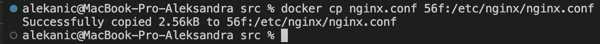\
*Использование команды docker cp*

+ **Restart nginx inside the docker image with exec.**\
**Перезапусти nginx внутри докер-образа через команду exec**

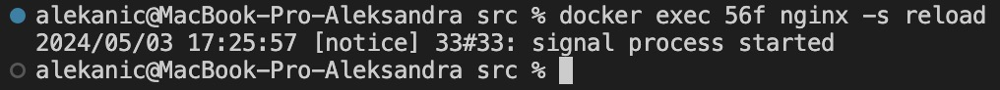\
*Использование команды docker exec*

+ **Check that localhost:80/status returns the nginx server status page.**\
**Проверь, что по адресу localhost:80/status отдается страничка со статусом сервера nginx**

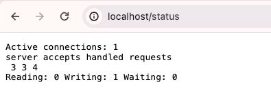\
*Проверка localhost:80/status*

+ **Export the container to a container.tar file with the export command.**\
**Экспортируй контейнер в файл container.tar через команду export.**

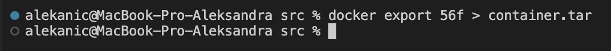\
*Использование команды docker export*

+ **Stop the container.**\
**Останови контейнер.**

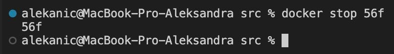\
*Использование команды docker stop*

+ **Delete the image with docker rmi [image_id|repository] without removing the container first.**\
**Удали образ через docker rmi [image_id|repository], не удаляя перед этим контейнеры.**

\
*Использование команды docker rmi -f nginx*

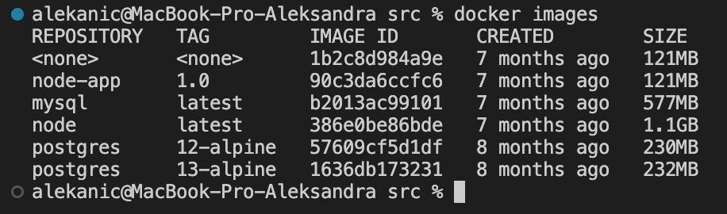\
*Проверка удаления образа с помощью команды docker images*

+ **Delete stopped container.**\
**Удали остановленный контейнер.**

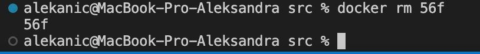\
*Использование команды docker rm*

+ **Import the container back using the `import` command.**\
**Импортируй контейнер обратно через команду `import`.**

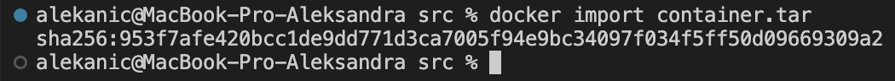\
*Использование команды docker import*

+ **Run the imported container.**\
**Запусти импортированный контейнер.**

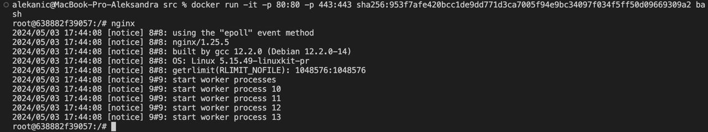\
*Использование команды docker run*

+ **Check that localhost:80/status returns the nginx server status page.**\
**Проверь, что по адресу localhost:80/status отдается страничка со статусом сервера nginx**

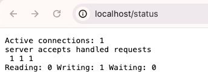\
*Проверка localhost:80/status*

## Part 3. Mini web server

+ **Write a mini server in C and FastCgi that will return a simple page saying Hello World!.**\
**Напиши мини-сервер на C и FastCgi, который будет возвращать простейшую страничку с надписью Hello World!**

Сначала качаем библиотеку "fcgi_stdio.h". На маках с помощью команды ```brew install fcgi```.

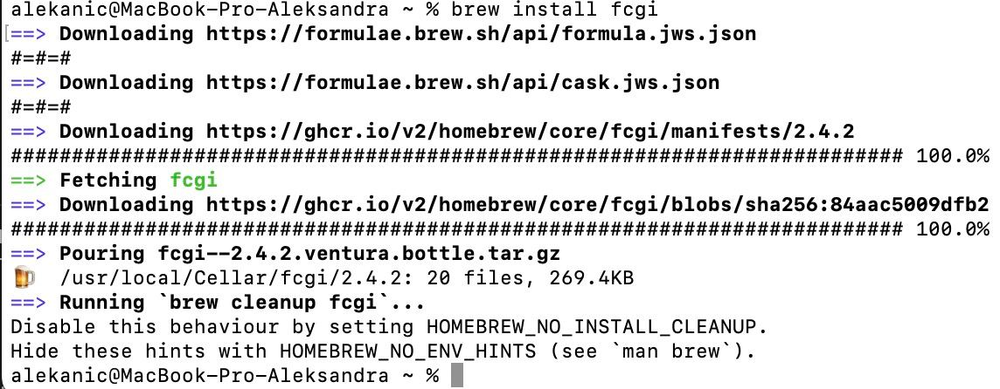\
*Установка FastCgi*

Пишем сервер:

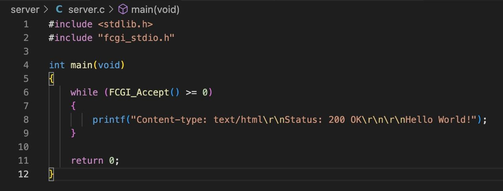\
*Простой сервер на си с использованием библиотеки fcgi_stdio.h*

+ **Run the written mini server via spawn-fcgi on port 8080.**\
**Запусти написанный мини-сервер через spawn-fcgi на порту 8080.**

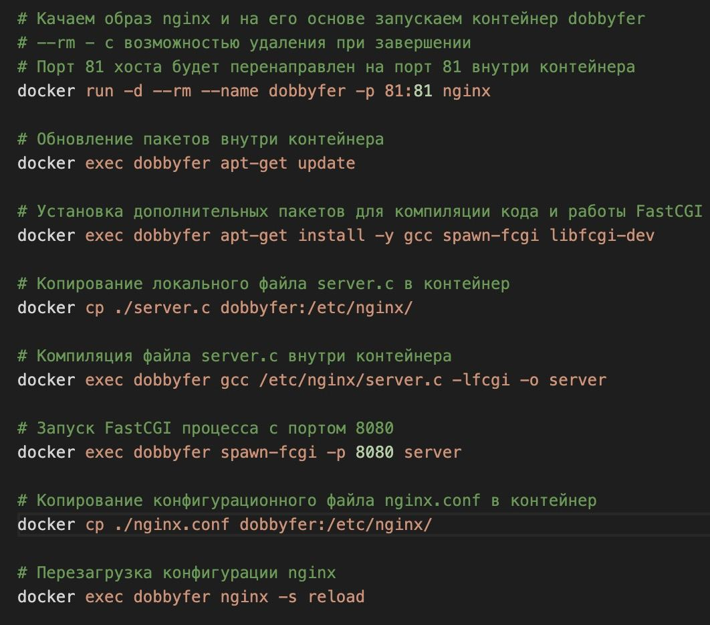\
*Cодержимое файла start_server.sh*

>Команда `docker exec` используется для выполнения команды в запущенном контейнере.\
`-d` - выполнение команды в фоновом режиме \
`-e` - установка переменной среды окружения \
`-i` - оставить STDIN открытым \
`-t` - выделение псевдотерминала \
`-w` определение рабочей директории внутри контейнера

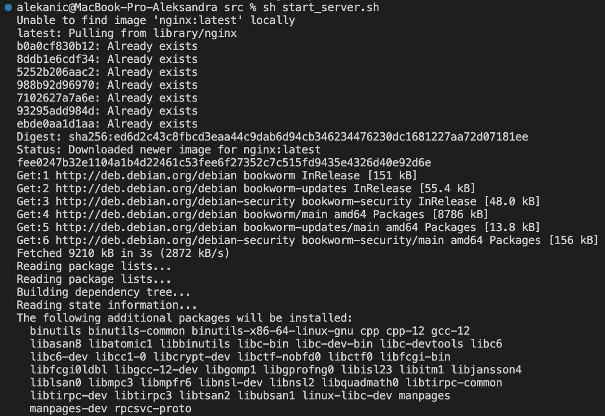\
*Запуск start_server.sh*

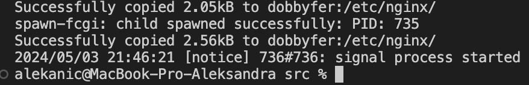\
*Окончание выполнения start_server.sh*

+ **Write your own nginx.conf that will proxy all requests from port 81 to 127.0.0.1:8080.**\
**Напиши свой nginx.conf, который будет проксировать все запросы с 81 порта на 127.0.0.1:8080.**

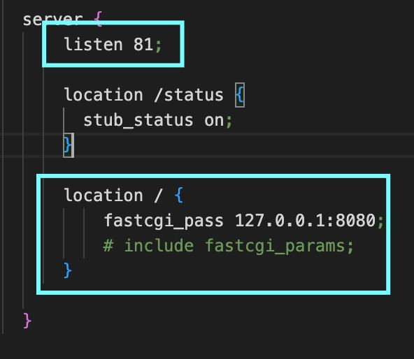\
*Cодержание файла nginx.conf*

+ **Check that browser on localhost:81 returns the page you wrote.**\
**Проверь, что в браузере по localhost:81 отдается написанная тобой страничка.**

\
*Проверка localhost:81*

+ **Put the nginx.conf file under ./nginx/nginx.conf (you will need this later).**\
**Положи файл nginx.conf по пути ./nginx/nginx.conf (это понадобится позже).**

## Part 4. Your own docker

+ **Write your own docker image that:**\
**Напиши свой докер-образ, который:**

  + **builds mini server sources on FastCgi from Part 3;**\
  **собирает исходники мини сервера на FastCgi из части 3;**

  + **runs it on port 8080;**\
  **запускает его на 8080 порт;**

  + **copies inside the image written ./nginx/nginx.conf;**\
  **копирует внутрь образа написанный ./nginx/nginx.conf;**

  + **runs nginx.**\
  **запускает nginx.**

**nginx can be installed inside the docker itself, or you can use a ready-made image with nginx as base.\
nginx можно установить внутрь докера самостоятельно, а можно воспользоваться готовым образом с nginx'ом, как базовым.**

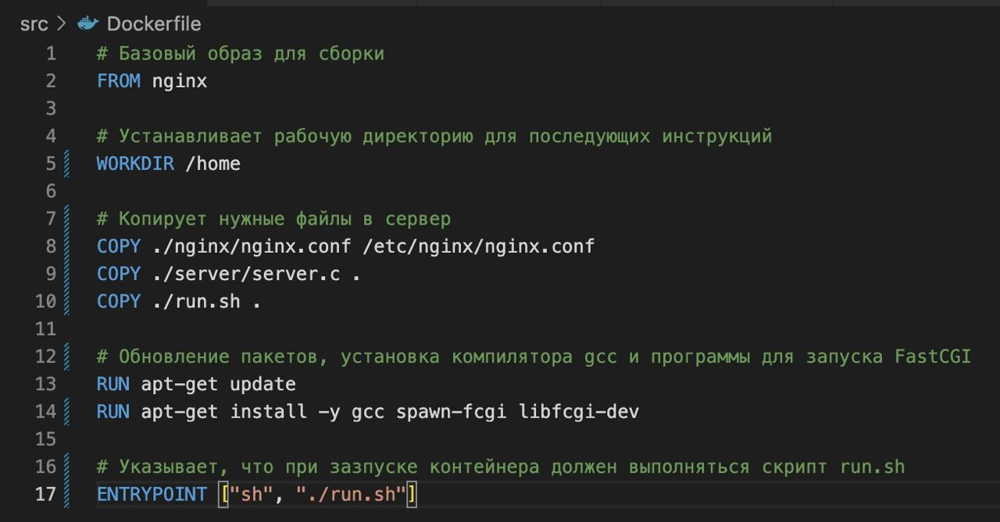\
*Содержимое файла dockerfile*

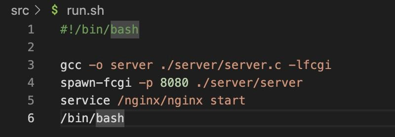\
*Содержимое файла run.sh*

+ **Build the written docker image with docker build, specifying the name and tag.**\
**Собери написанный докер-образ через docker build при этом указав имя и тег.**

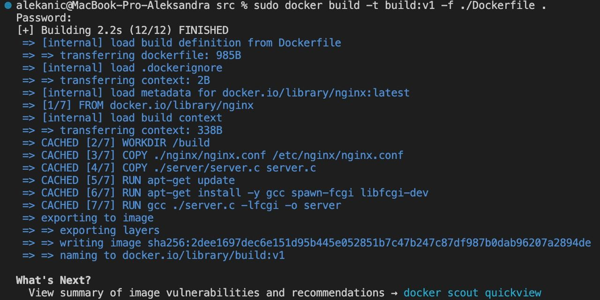\
*Запуск команды docker build*

+ **Check with docker images that everything is built correctly.**\
**Проверь через docker images, что все собралось корректно.**

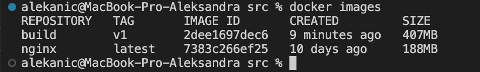\
*Запуск команды docker images*

+ **Run the built docker image by mapping port 81 to 80 on the local machine and mapping the ./nginx folder inside the container to the address where the nginx configuration files are located (see Part 2).**\
**Запусти собранный докер-образ с маппингом 81 порта на 80 на локальной машине и маппингом папки ./nginx внутрь контейнера по адресу, где лежат конфигурационные файлы nginx'а**

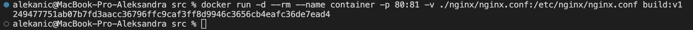\
*Запуск образа part4image*

+ **Check that the page of the written mini server is available on localhost:80.**\
**Проверь, что по localhost:80 доступна страничка написанного мини сервера.**

\
*Проверка localhost:80*

+ **Add proxying of /status page in ./nginx/nginx.conf to return the nginx server status.*\
**Допиши в ./nginx/nginx.conf проксирование странички /status, по которой надо отдавать статус сервера nginx.**

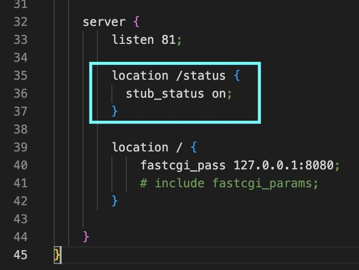\
*Дополненный nginx.conf*

+ **Restart docker image.**\
**Перезапусти докер-образ.**

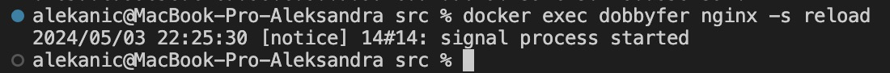\
*Обновление nginx*

+ **If everything is done correctly, after saving the file and restarting the container, the configuration file inside the docker image should update itself without any extra steps**\
**Если всё сделано верно, то, после сохранения файла и перезапуска контейнера, конфигурационный файл внутри докер-образа должен обновиться самостоятельно без лишних действий**

+ **Check that localhost:80/status now returns a page with nginx status.**\
**Проверь, что теперь по localhost:80/status отдается страничка со статусом nginx**

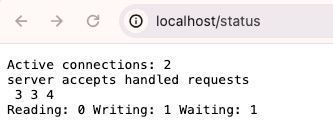\
*Обновление localhost/status*

## Part 5. Dockle

+ **Check the image from the previous task with dockle [image_id|repository].**\
**Просканируй образ из предыдущего задания через dockle [image_id|repository].**

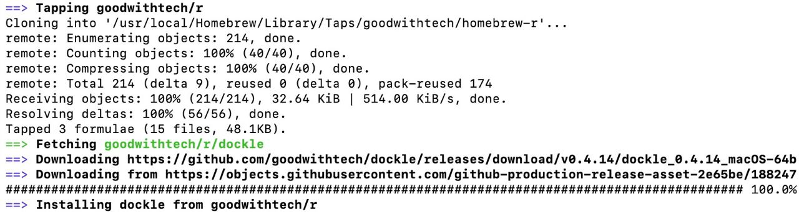 \
*Загрузка dockle на mac*

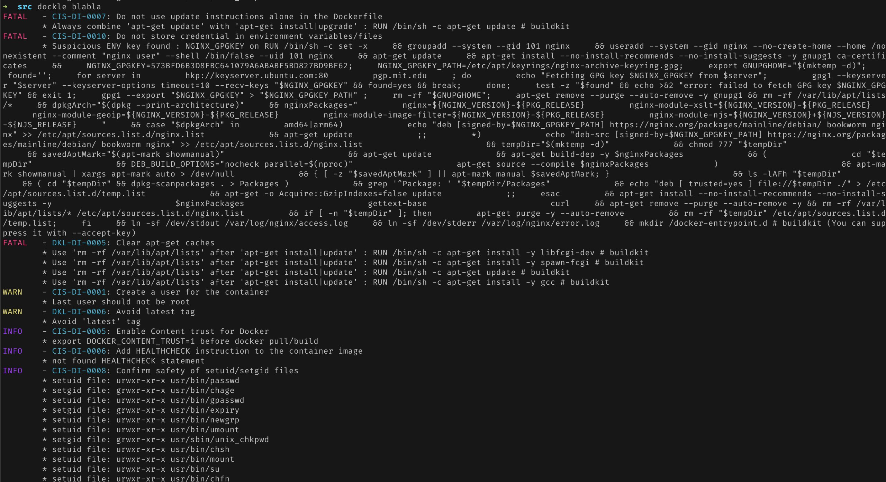 \
*Проверка образа с помощью dockle*

+ **Fix the image so that there are no errors or warnings when checking with dockle.**\
**Исправь образ так, чтобы при проверке через dockle не было ошибок и предупреждений.**

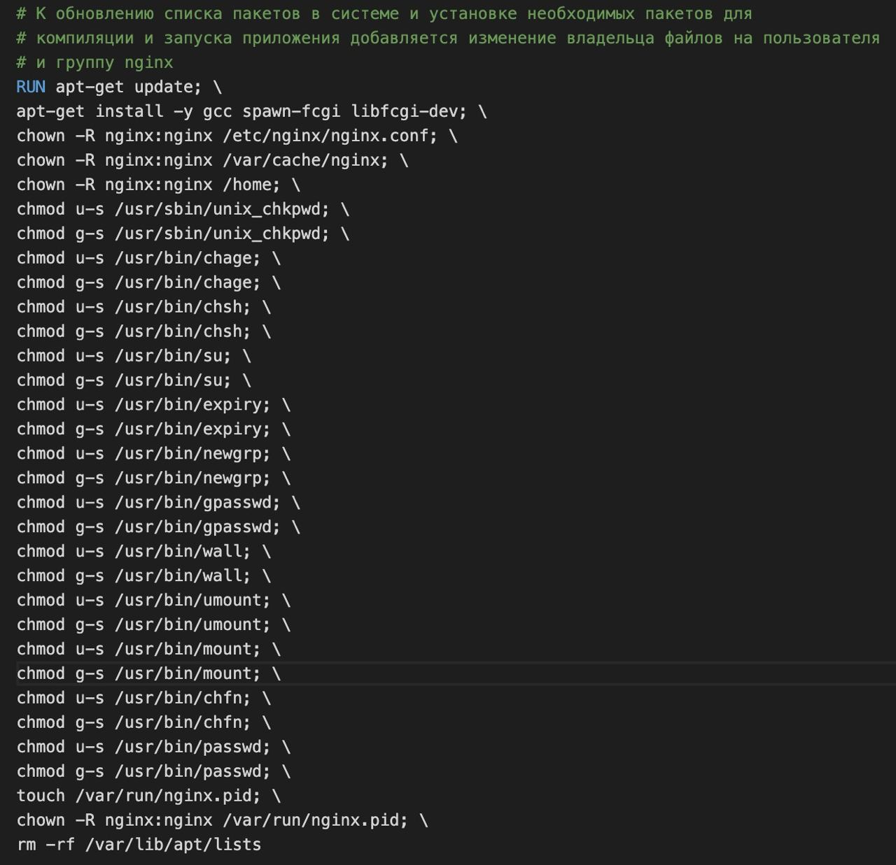 \
*Измененный Dockerfile*

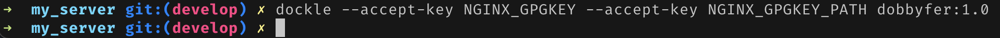 \
*Повторная проверка образа с помощью dockle*

## Part 6. Basic Docker Compose

+ **Write a `docker-compose.yml` file, using which:**\
**Напиши файл `docker-compose.yml`, с помощью которого:**

  + **Start the docker container from Part 5 (it must work on local network, i.e., you don't need to use EXPOSE instruction and map ports to local machine).**\
  **Подними докер-контейнер из Части 5 (он должен работать в локальной сети, т.е. не нужно использовать инструкцию EXPOSE и мапить порты на локальную машину).**

  + **Start the docker container with nginx which will proxy all requests from port 8080 to port 81 of the first container.**\
  **Подними докер-контейнер с nginx, который будет проксировать все запросы с 8080 порта на 81 порт первого контейнера.**

  + **Map port 8080 of the second container to port 80 of the local machine.**\
  **Замапь 8080 порт второго контейнера на 80 порт локальной машины.**

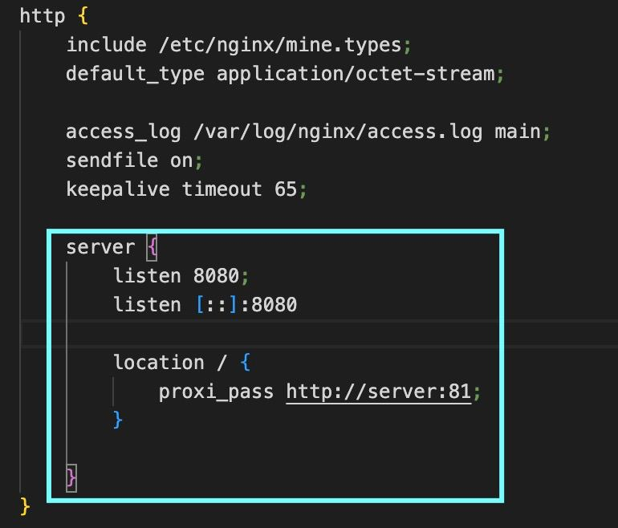 \
*Измененный файл nginx.conf*

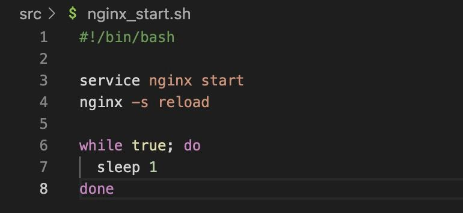 \
*Скрипт для запуска nginx*

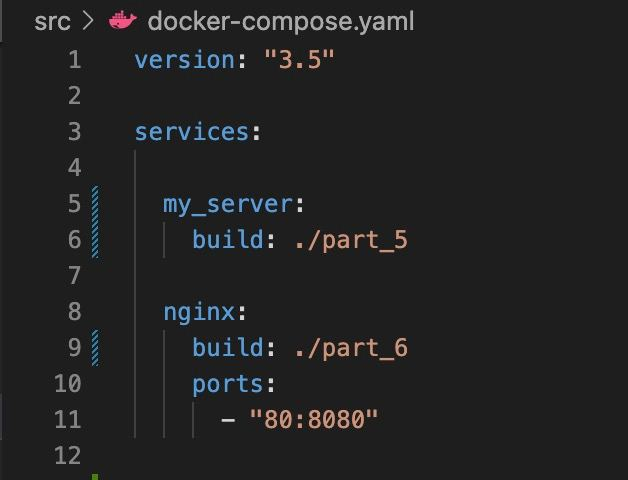 \
*Запуск docker-compose*

+ **Stop all running containers.**\
**Останови все запущенные контейнеры.**

+ **Build and run the project with the `docker-compose build` and `docker-compose up` commands.**\
**Собери и запусти проект с помощью команд `docker-compose build` и `docker-compose up`.**

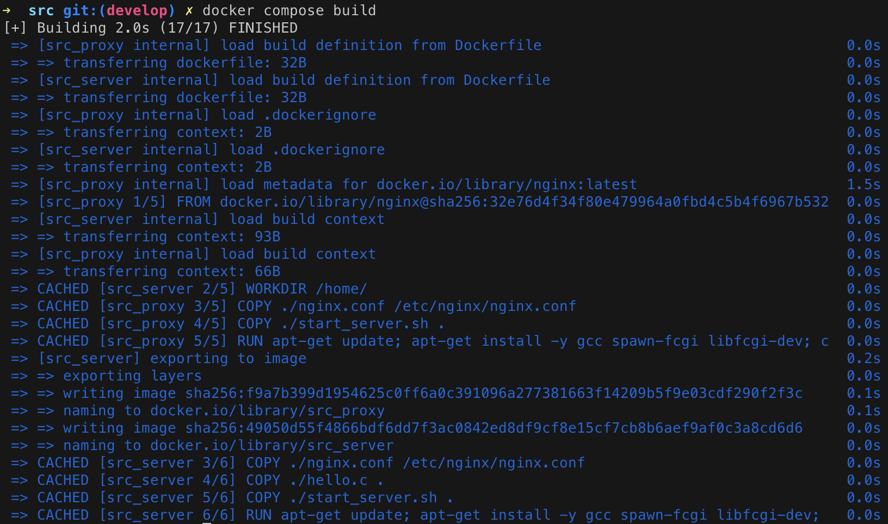 \
*docker build*

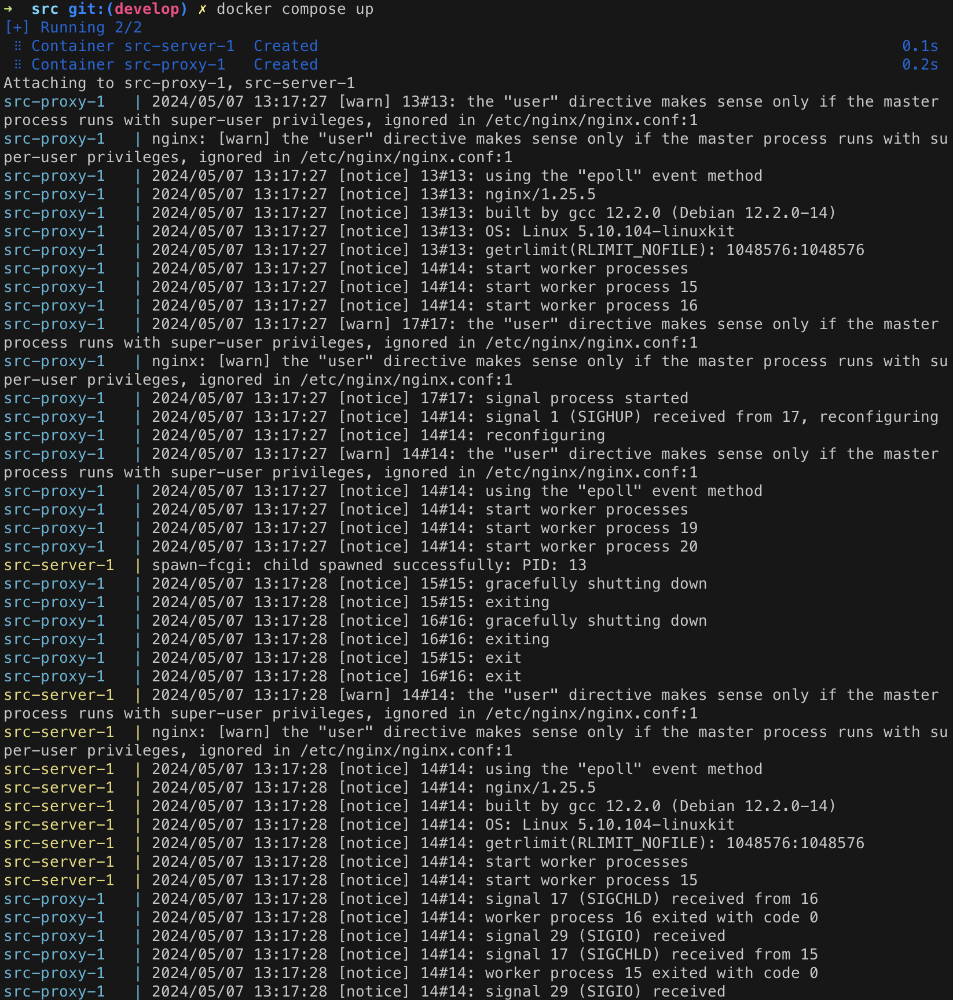 \
*docker compose up*

+ **Check that the browser returns the page you wrote on localhost:80 as before.**\
**Проверь, что в браузере по localhost:80 отдается написанная тобой страничка, как и ранее.**

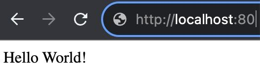 \
*Проверка localhost:80*

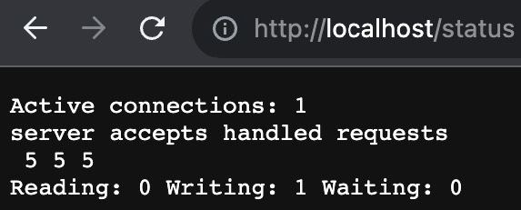 \
*Проверка localhost:80/status*

